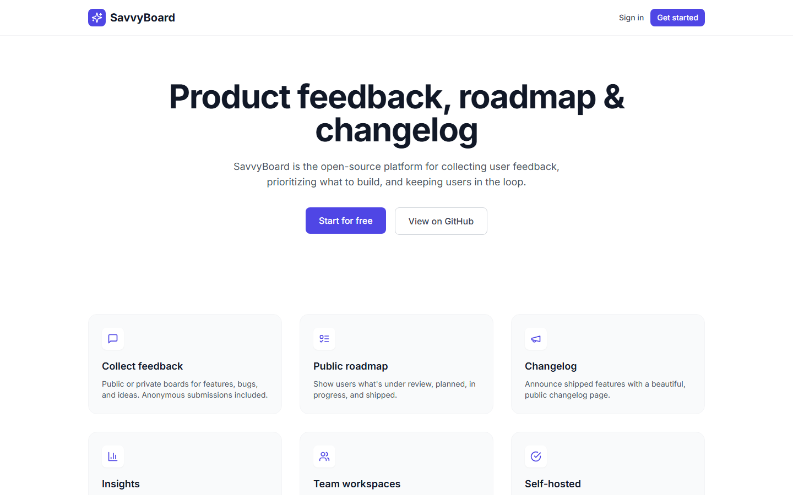
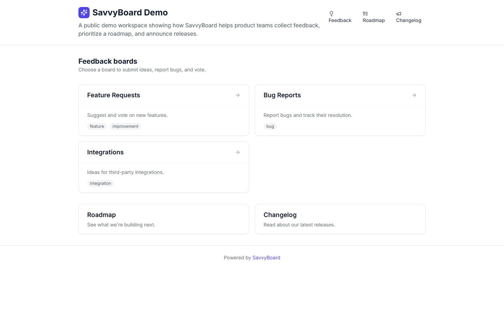
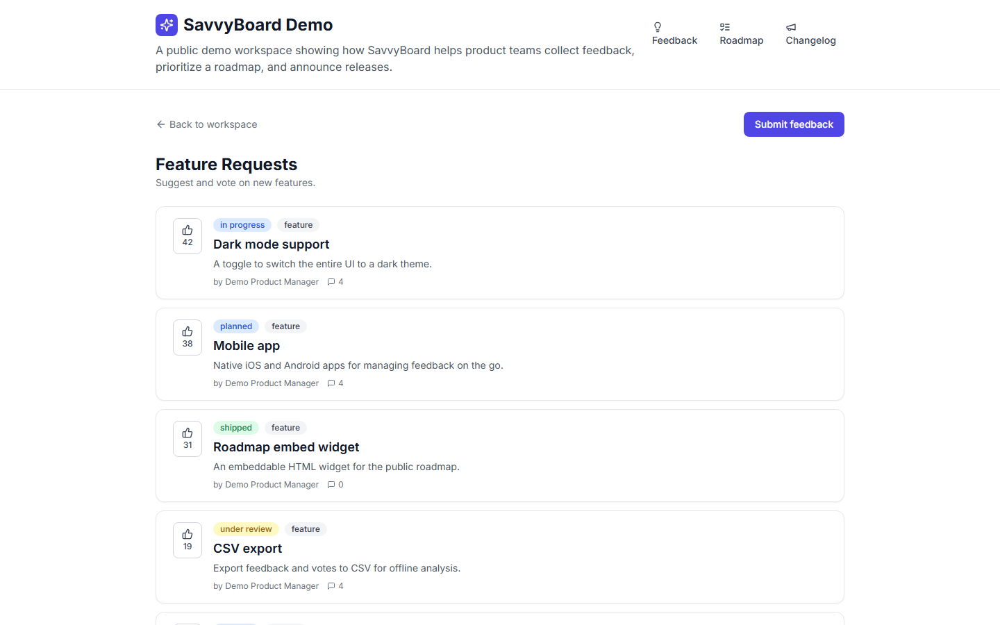
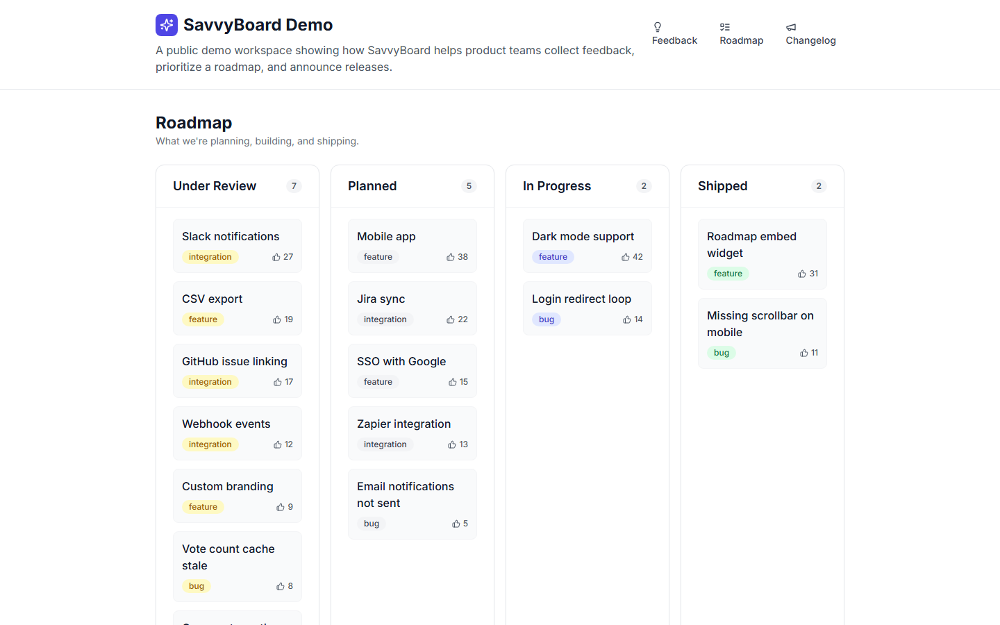
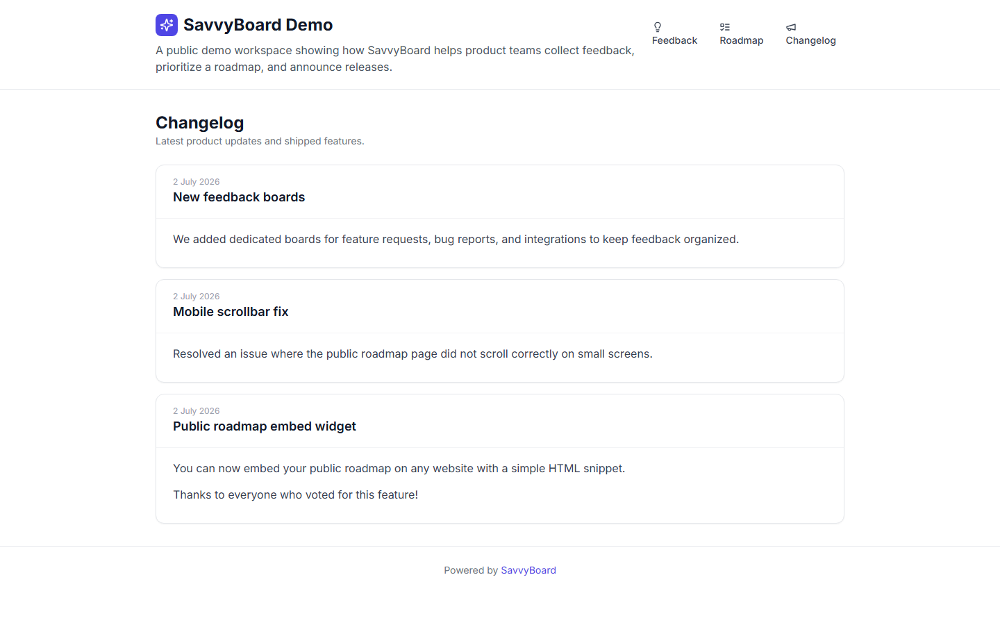
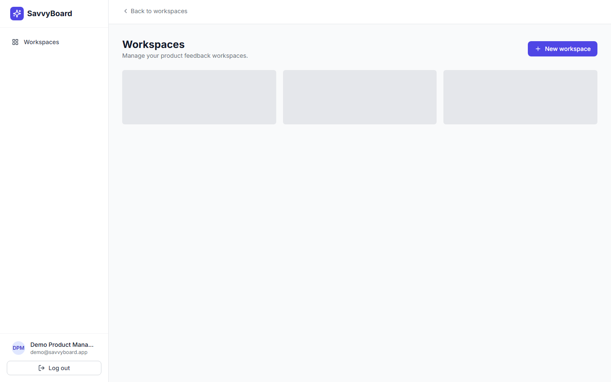
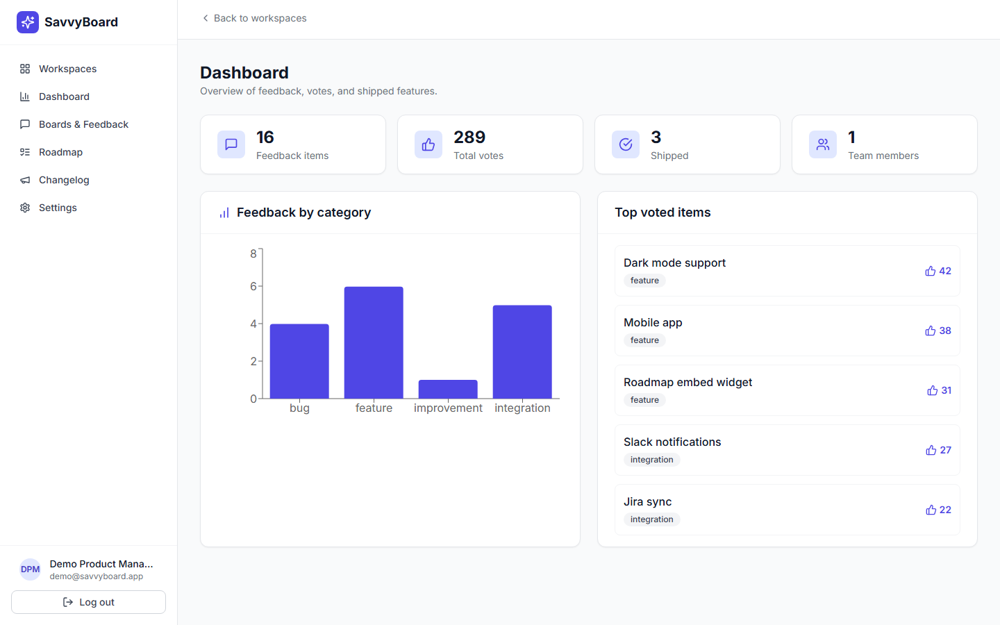
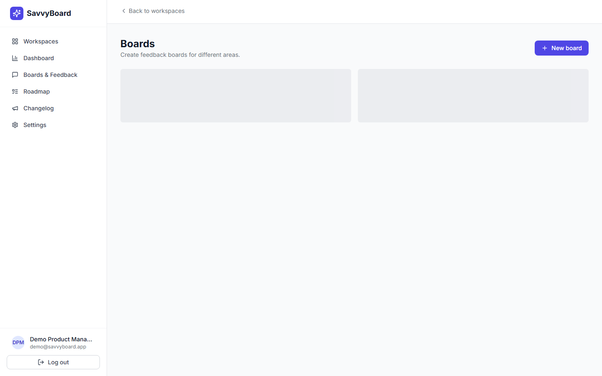
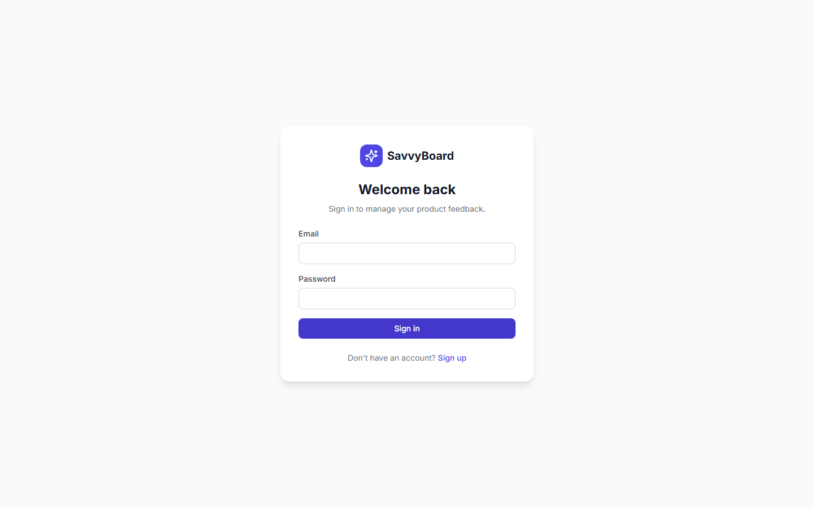

# SavvyBoard

An open-source, self-hostable product feedback, public roadmap, and changelog platform for product teams.

<p align="center">
  
</p>

[](LICENSE)
[](https://www.python.org/)
[](https://fastapi.tiangolo.com/)
[](https://react.dev/)
[](https://www.typescriptlang.org/)

## What is SavvyBoard?

SavvyBoard helps product managers and SaaS teams close the feedback loop with their users:

- **Collect feedback** through public or private boards.
- **Prioritize with voting** — users upvote the ideas they care about most.
- **Share a transparent roadmap** — Kanban-style public roadmap with status columns.
- **Publish a changelog** — announce shipped features and link them back to feedback.
- **Admin dashboard** — track feedback volume, votes, categories, and recent activity.

Built with **FastAPI + SQLModel** on the backend and **React + TypeScript + TailwindCSS** on the frontend. Deploy it anywhere with Docker Compose.

## Demo screenshots

All screenshots below were captured from the built-in demo seed data running locally.

### Public portal

| Landing page | Workspace home | Public feedback board |
|--------------|----------------|------------------------|
|  |  |  |

| Roadmap | Changelog |
|---------|-----------|
|  |  |

### Admin dashboard

| Workspaces | Dashboard | Boards | Feedback |
|------------|-----------|--------|----------|
|  |  |  |  |

## Features

- **Authentication** — email/password registration and login with JWT access + refresh tokens.
- **Workspaces** — multi-tenant workspaces with slug-based public URLs (`/w/<slug>`).
- **Boards** — public or private feedback boards per workspace with configurable categories.
- **Feedback items** — title, description, category, status, author info, and anonymous support.
- **Voting** — one vote per user (or anonymous token) per item.
- **Comments** — threaded discussion on feedback items.
- **Roadmap** — move items across *Under Review*, *Planned*, *In Progress*, *Shipped*, and *Closed*.
- **Changelog** — publish release notes and link them to shipped feedback items.
- **Admin analytics** — metrics cards and Recharts-powered charts for feedback categories and votes.
- **Docker deployment** — one-command Docker Compose stack with PostgreSQL.

## Tech stack

| Layer | Technology |
|-------|------------|
| Backend API | Python 3.11, FastAPI, Pydantic v2 |
| ORM / Models | SQLModel |
| Database | PostgreSQL 15 (production), SQLite supported for local dev |
| Migrations | Alembic |
| Auth | JWT (access + refresh), bcrypt |
| Frontend | React 18, TypeScript, Vite |
| Styling | TailwindCSS + Microsoft Fluent UI React |
| Data fetching | TanStack Query (React Query), Axios |
| Routing | React Router v6 |
| Charts | Recharts |
| Testing | pytest (backend), Vitest (frontend) |
| Screenshots | Playwright |

## Quick start with Docker

The fastest way to run SavvyBoard locally:

```bash
# Clone the repository
git clone https://github.com/ravipurohit1991/savvyboard.git
cd savvyboard

# Copy the example environment file and start the stack
cp .env.example .env
docker compose up --build
```

Once the containers are healthy:

- Frontend: http://localhost
- Backend API docs: http://localhost:8000/api/v1/docs
- Default admin user: `admin@example.com` / `admin123`

The first time the backend starts it creates the configured superuser automatically.

## Local development

### Backend

```bash
cd backend
python -m venv .venv
source .venv/bin/activate  # On Windows: .venv\Scripts\activate
pip install -r requirements.txt

# Run with SQLite for local dev (set in .env)
# DATABASE_URI=sqlite:///./savvyboard.db
uvicorn app.main:app --reload --port 8000
```

The backend will auto-create tables on startup (`init_db`).

### Frontend

```bash
cd frontend
npm install
npm run dev
```

The dev server runs at http://localhost:5173 and proxies `/api/v1` to the backend.

### Demo data & screenshots

To seed the demo workspace and generate the README screenshots:

```bash
# Backend and frontend dev servers must be running
cd backend
python scripts/seed_demo.py

cd ../frontend
node scripts/take-screenshots.mjs
```

## API documentation

FastAPI auto-generates interactive API documentation from the source code:

- Swagger UI: `/api/v1/docs`
- ReDoc: `/api/v1/redoc`
- OpenAPI schema: `/api/v1/openapi.json`

## Running tests

### Backend

```bash
cd backend
pytest
```

### Frontend

```bash
cd frontend
npm test
```

## Project structure

```
savvyboard/
├── backend/
│   ├── app/
│   │   ├── api/           # FastAPI routes & dependencies
│   │   ├── core/          # config, security, DB engine
│   │   ├── crud/          # database operations
│   │   ├── models.py      # SQLModel table definitions
│   │   ├── schemas/       # Pydantic request/response models
│   │   └── tests/         # pytest test suite
│   ├── scripts/           # seed_demo.py
│   ├── alembic/           # migration files
│   ├── Dockerfile
│   └── requirements.txt
├── frontend/
│   ├── src/
│   │   ├── api/           # Axios client
│   │   ├── components/    # shared UI components
│   │   ├── hooks/         # auth & query hooks
│   │   ├── pages/         # route pages
│   │   └── routes/        # React Router config
│   ├── scripts/           # Playwright screenshot script
│   ├── Dockerfile
│   └── package.json
├── docker-compose.yml
├── screenshots/           # demo screenshots used by README
├── .env.example
└── LICENSE
```

## Environment variables

Copy `.env.example` to `.env` and adjust as needed. Key variables:

| Variable | Description |
|----------|-------------|
| `SECRET_KEY` | JWT signing secret — change this in production |
| `DATABASE_URI` | SQLAlchemy database URI |
| `FRONTEND_HOST` | Public URL of the frontend |
| `BACKEND_CORS_ORIGINS` | Comma-separated allowed CORS origins |
| `FIRST_SUPERUSER_EMAIL` / `FIRST_SUPERUSER_PASSWORD` | Auto-created admin account |

## Contributing

Contributions are welcome! Please open an issue first to discuss large changes, then submit a pull request.

1. Fork the repository.
2. Create a feature branch (`git checkout -b feature/my-feature`).
3. Make your changes and add tests where appropriate.
4. Ensure tests pass (`pytest` and `npm test`).
5. Submit a pull request.

## License

[MIT](LICENSE) © 2026 Ravi Purushottam

## Author

- **Ravi Purushottam**
- GitHub: [@ravipurohit1991](https://github.com/ravipurohit1991)
- Email: ravi.purushottamrajpurohit@gmail.com

Built to help product teams ship what users actually want.
